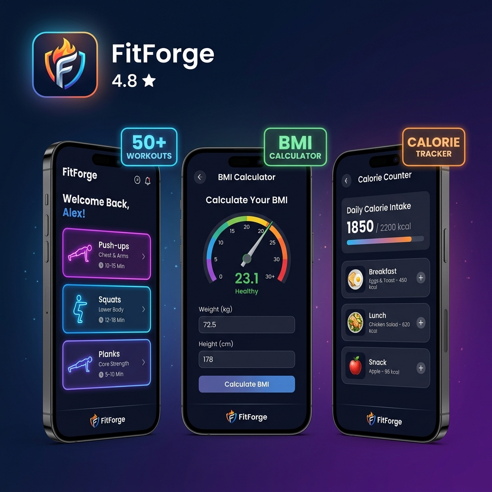

# 💪 FitForge - Your Complete Fitness Hub

## 📱 Download APK

👉 **[Download Latest Release](https://github.com/yasyts/fitforge-android/releases/tag/v1.0)**

## ✨ Features

| Feature | Description |
|---------|-------------|
| 🏋️ **50+ Workouts** | Push-ups, Squats, Planks, Lunges & more with rep tracking |
| 📊 **BMI Calculator** | Calculate your Body Mass Index instantly |
| 🔥 **Calorie Counter** | Track your daily calorie intake |
| ⏱️ **4-in-1 Tools** | Clock, Alarm, Timer & Stopwatch |
| 💜 **Donate** | Support development via Razorpay |
| 🌙 **Dark Theme** | Beautiful premium dark UI with neon accents |

## 📲 How to Install

1. Download `app-release.apk` from the [Releases](https://github.com/yasyts/fitforge-android/releases) page
2. Open the APK on your Android phone
3. Tap **Install** (enable "Install from unknown sources" if prompted)
4. Enjoy your fitness journey! 💪

## 🛠️ Tech Stack

- **Android** (Kotlin)
- **WebView** wrapping a premium HTML/CSS/JS fitness website
- **Razorpay** payment integration for donations
- **Material Design** dark theme

## 📸 Screenshots

The app features a stunning dark-themed interface with:
- Gradient cards for workout categories
- Interactive BMI & Calorie calculators
- Built-in Clock, Alarm, Timer & Stopwatch tools
- Smooth animations and premium glassmorphism effects

## 📄 License

Free to use. Built with ❤️ by [yasyts](https://github.com/yasyts)
